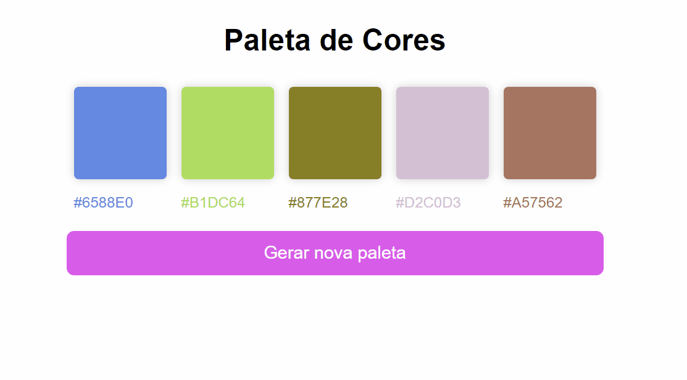

# 🖥 "Paleta de Cores" 🎯

## 📑 Descrição

Como Dev front end ter uma paleta de cores na hora de estilizar os projetos facilitam muito, pensando nisso e para treinamento também realizei essa paleta de cores.

## ⏱ Processo

- Marcação semâncitca
- Propriedades personalizadas de CSS
- JavaScript

## ⏲ Função

Ao Clicar no botão gerar nova paleta, vai gerando as paletas de cores com seus respectivos códigos.

## 🚀A página👌

<a href="https://charming-croquembouche-a7a4ec.netlify.app/" target= "-blank">Acesse a página online</a>

## 🧞‍♀️ Desenvolvedora

<table align="center">
  <tr>
    <td align="center">
      

         
          <b> Claudinéia Torres </b> 
            
            
      

    </td>

  </tr>
</table>